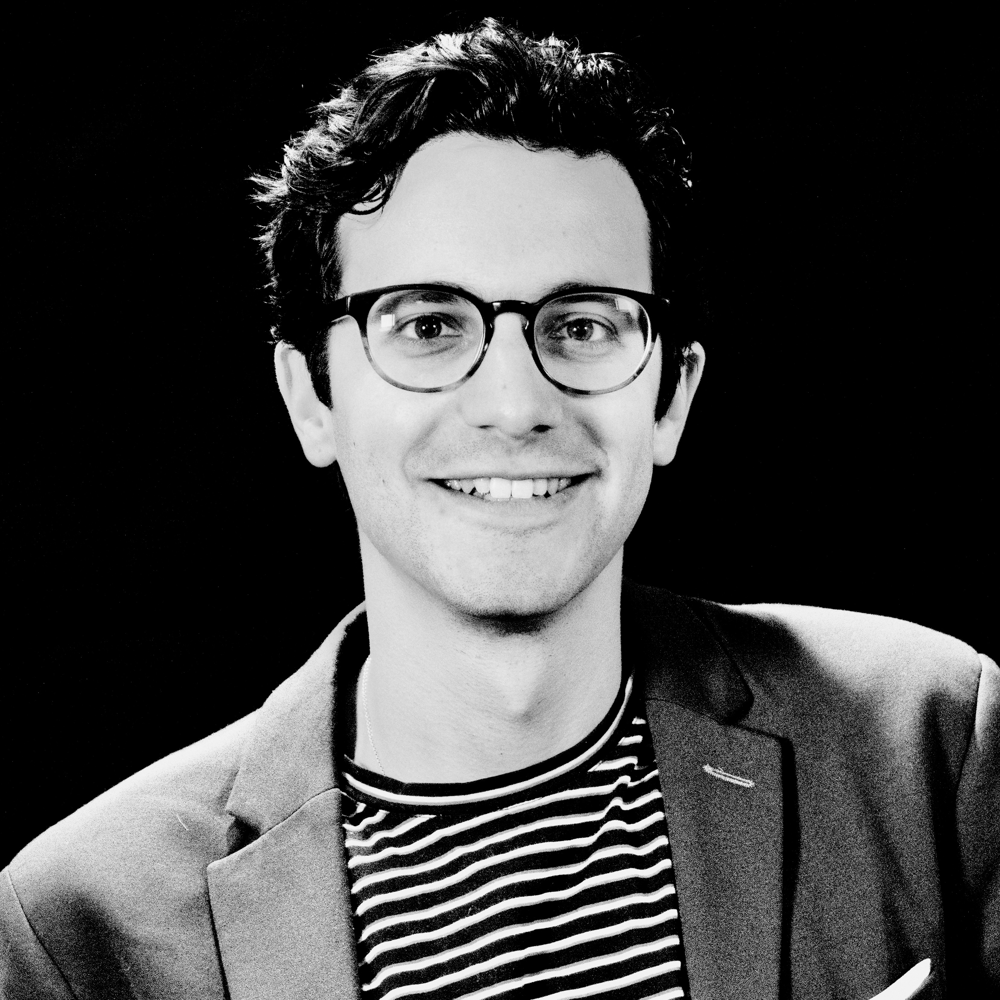

I am a machine learning research scientist in the MosaicML team at Databricks.

I am broadly interested in developing experimentally motivated, mathematically grounded theories of both artificial and biological neural networks. I did my PhD in the [Center for Theoretical Neuroscience](https://ctn.zuckermaninstitute.columbia.edu/) at Columbia University. After my PhD, I was a Research Scientist at [MosaicML](https://www.mosaicml.com/), which got acquired by Databricks in July 2023.

I look forward to the day when we start applying everything we've learned about LLMs to hard problems in systems neuroscience. For now though, I think there is a lot of exciting research at the forefront of LLM pretraining, finetuning and deployment.

Feel free to reach out at jacob.portes [arroba] databricks.com
