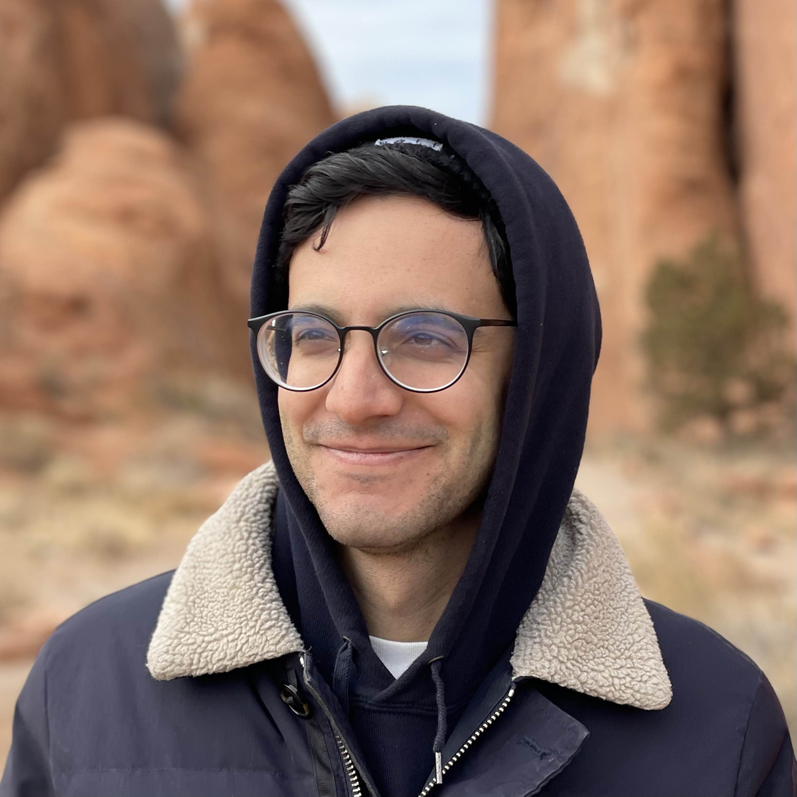

I am interested in developing experimentally motivated, mathematically grounded theories of both artificial and biological neural networks. I recently finished my PhD in the [Center for Theoretical Neuroscience](https://ctn.zuckermaninstitute.columbia.edu/) at Columbia University.

I like it when machine learning informs neuroscience, and when neuroscience inspires machine learning.

As of July 2022, I am a Research Scientist at [MosaicML](https://www.mosaicml.com/).

Feel free to reach out at jacob [arroba] mosaicml.com
